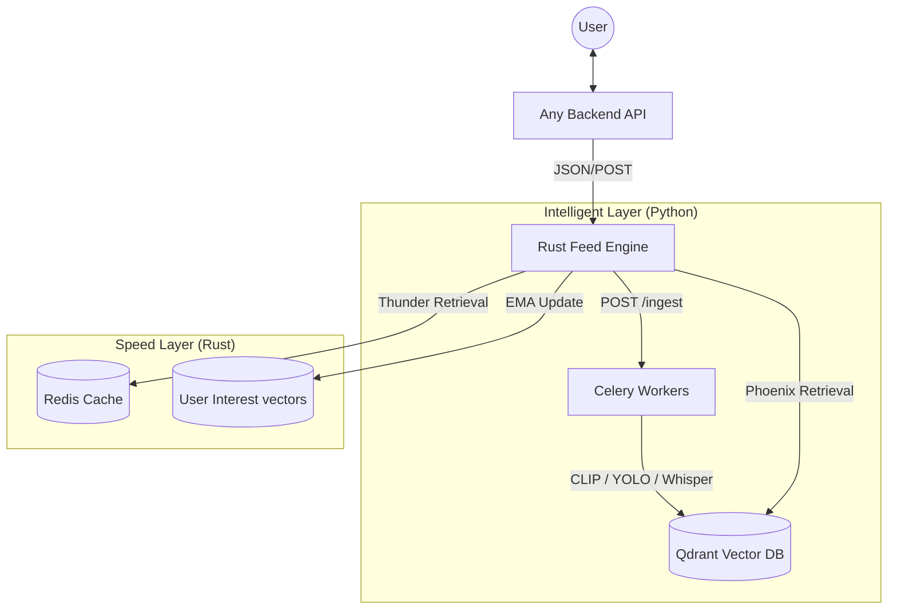

# Phoenix Feed Engine: High-Performance Recommendation System

A robust, multi-stage recommendation engine designed for massive scale. This project combines the speed of **Rust** for real-time ranking and retrieval with the intelligence of **Python** for lightweight Machine Learning inference.

## 🚀 System Architecture



### Core Technologies
*   **Rust (Axum + Tokio + Rayon):** High-throughput feed generation and scoring.
*   **Python (CLIP + YOLOv8n + faster-whisper):** Lightweight ML for content understanding.
*   **Qdrant:** High-performance vector database for semantic discovery.
*   **Redis:** Real-time stream processing, caching, and social graph indexing.

---

## 🛠 Component Breakdown

### 1. Rust Feed Engine (`rust_feed_engine/`)
The brain of the system. It handles:
*   **Multi-Stage Pipeline:** Implements Query Hydration, Candidate Retrieval, Filtering, Scoring, and Re-ranking.
*   **Real-time Interaction Tracking:** Updates user interest vectors (EMA-based) on every like, share, or dwell event.
*   **Dual-Source Retrieval:**
    *   **Thunder:** Instant in-network fetching from followers via Redis.
    *   **Phoenix:** Semantic out-of-network discovery via Qdrant ANN search.

### 2. Smart Ingestion (`smart_ingestion/`)
A lightweight ML pipeline that transforms raw content into mathematical vectors:
*   **Text:** MiniLM-L6-v2 (384-dim).
*   **Visuals:** CLIP ViT-B/32 (512-dim).
*   **Audio:** faster-whisper (tiny-int8) for near-instant transcription.
*   **Objects:** YOLOv8n for tag extraction.

---

## 🔌 Plug-and-Play Integration

This service is designed to be **backend-agnostic**. You can plug it into any existing application (Node.js, Go, Python, etc.) by implementing three simple integration points.

### 1. Record Interactions
When a user interacts with a post, notify the Rust engine to update their interest profile.
```bash
POST /interaction
{
  "user_id": 123,
  "post_id": 456,
  "action": "like",
  "post_type": "video",
  "author_id": 789
}
```

### 2. Request a Feed
Proxy your user's feed requests directly to the Rust engine.
```bash
POST /feed
{
  "user_id": 123,
  "limit": 50
}
```

### 3. Provide a Social Graph
The Rust engine will request the user's social graph from your backend via the `BACKEND_URL` environment variable.
```bash
GET /internal/social-graph/{user_id}/
Returns: {"following": [ids...], "blocked": [ids...]}
```

---

## 🏎 Performance Engineering

| Metric | Result | Description |
| :--- | :--- | :--- |
| **Throughput** | **57.42 req/sec** | Sustainable capacity under high computational load. |
| **Avg Latency** | **582.14 ms** | Average response time per feed request (10k candidates). |
| **P99 Latency** | **844.20 ms** | 99% of users receive their feed in under 850ms. |

### Key Optimizations
1.  **Presence-Aware Ingestion:** Detects online users and prioritizes their feeds during background fan-out.
2.  **O(N) Top-K Selection:** Linear selection algorithm for constant-time performance even with 100k+ candidates.
3.  **EMA Interest Drifting:** User vectors drift toward active interests in real-time, requiring zero model retraining.

---

## 📥 Setup & Deployment

### Prerequisites
*   **Rust:** 1.75+
*   **Redis:** 7.0+
*   **Python:** 3.10+
*   **FFmpeg:** (For video processing)

### Local Development
1.  **Clone the repository:**
    ```bash
    git clone https://github.com/Lutssh/Feed_algorithm.git
    cd Feed_algorithm
    ```

2.  **Run the automated setup script:**
    ```bash
    ./run_local.sh
    ```
    *This script handles virtual environments, downloads the Qdrant binary, installs dependencies, and starts background services.*

### Environment Variables
| Variable | Default | Purpose |
| :--- | :--- | :--- |
| `REDIS_URL` | `redis://127.0.0.1:6379` | Primary feature store & cache. |
| `QDRANT_URL` | `http://localhost:6334` | Vector database address. |
| `BACKEND_URL` | `http://localhost:8000` | Address of your main application API. |
| `RUST_LOG` | `info` | Logging verbosity. |

---

## 📝 License
This project is licensed under the MIT License - see the LICENSE file for details.
